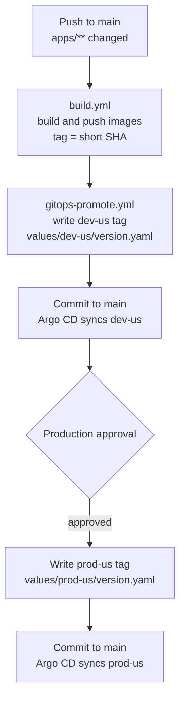
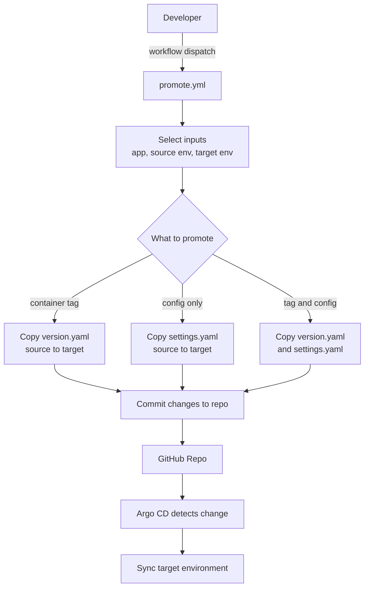

# k8s-platform

GitOps-oriented Kubernetes platform: **Argo CD + Helm + Terraform**, with **CI/CD image builds**, **environment overlays**, and a **local Docker Compose** stack for development.

---

## What’s in this repo

| Area | Purpose |
|------|---------|
| **`apps/`** | Source code and **Dockerfiles** for each runnable service (build contexts for CI and Compose). |
| **`charts/`** | **Helm charts** (Kubernetes packaging): `web`, `api`, `ws`, `worker`, `redis`. Base defaults live in each chart’s `values.yaml`. |
| **`values/`** | **Per-environment Helm values** and image tags: `values/<chart>/<env>/values.yaml` plus `version.yaml` (image tag / digest overrides). |
| **`argocd/`** | **Argo CD Application manifests** (bootstrap) that point Argo at this repo: chart path + value file list per app/env. |
| **`terraform/aws/`** | **AWS platform**: VPC, EKS, RDS, Argo CD, External Secrets Operator, AWS Load Balancer Controller, etc. See [`terraform/aws/README.md`](./terraform/aws/README.md). |
| **`.github/workflows/`** | **CI/CD**: `build.yml`, `gitops-promote.yml`, `promote.yml` (single app), `promote-all.yml` (all apps), `tf-ci.yml` (Terraform plan/apply for `terraform/aws`). |
| **`docker-compose.yml`** | **Local stack**: Postgres, Redis, api, ws, worker, web (mirrors the app architecture without Kubernetes). |

### `apps/` — services you build and run

| Path | Role | Links to other services |
|------|------|--------------------------|
| **`apps/web/`** | React (Vite) SPA, nginx in production image; `api-config.js` / env for API and WebSocket URLs. | **Calls** `api` over HTTP (`/api/...`) and **subscribes** to `ws` (`/ws?room=notifications`) for realtime job updates. |
| **`apps/api/`** | FastAPI HTTP API, Alembic migrations, Postgres + Redis; job enqueue API. | **Reads/writes** Postgres for app data, **pushes jobs** to Redis queue (`jobs:queue`) for `worker`, and serves responses to `web`. |
| **`apps/ws/`** | FastAPI WebSocket service; Redis pub/sub fan-out to rooms (e.g. notifications). | **Subscribes** to Redis pub/sub (`jobs:events`) and **broadcasts** those events to connected `web` clients. |
| **`apps/worker/`** | Python worker: Redis queue consumer, Postgres, publishes events for realtime updates. | **Consumes** Redis queue (`jobs:queue`) from `api`, **updates** Postgres job/item state, then **publishes** lifecycle events to Redis pub/sub (`jobs:events`) for `ws`. |

Runtime interaction summary:

- `web -> api`: schedule/list jobs over HTTP.
- `api -> redis queue`: enqueue `job_id` to `jobs:queue`.
- `worker <- redis queue`: take job, mark `processing`, complete work in Postgres.
- `worker -> redis pub/sub`: publish `job.processing` and `job.completed` to `jobs:events`.
- `ws <- redis pub/sub -> web`: fan out events to all connected browsers in `notifications`.

Each app directory contains its own **`Dockerfile`** (and typically `requirements.txt` / `package.json` as appropriate). CI builds from these paths when `apps/<name>/` changes.

### `charts/` — Helm

Each subdirectory is a chart (e.g. `charts/web`, `charts/api`). Templates define Deployments, Services, Ingress, HPA, **ExternalSecrets** (AWS Secrets Manager / RDS credentials where enabled), ConfigMaps, etc. Argo deploys these charts using values merged from `values/`.

### `values/` — environment overlays

- **`values/<app>/<env>/values.yaml`** — replicas, resources, ingress hosts, `apiPublicUrl` / `wsPublicUrl` for web, External Secret settings, etc.
- **`values/<app>/<env>/version.yaml`** — **image tag** (and optional digest) for that env; CI and promotions edit this file.

Keep **`version.yaml` last** in Argo `helm.valueFiles` so tag bumps win over static env config.

### `argocd/` — GitOps bootstrap

Example layout: **`argocd/bootstrap/dev/apps/*.yaml`** — one **Application** per workload (`web`, `api`, `ws`, `worker`, `redis`) for the `dev` bootstrap. Each spec selects the matching chart under `charts/` and the overlay under `values/...`. Add more folders (e.g. `prod/`) the same way as you add environments.

---

## CI/CD & GitOps promotion flow

- Build/push images only for changed services
- Auto-bump **dev** to the freshly built tag
- Require an **environment approval gate** before promoting the *same tag* to **prod**
- Support **manual promotions** via workflow dispatch (copy tag and/or config between env overlays)

### GitOps CI/CD automation



- **Build changed services (`.github/workflows/build.yml`)**: On pushes to `main` that touch `apps/**`, paths-filter detects only the changed app directories and builds/pushes GHCR images tagged with the short SHA. An artifact (`changed-apps.json`) lists which apps moved.
- **Bump dev with the built tag (`gitops-bump-tags`)**: The follow-on workflow `.github/workflows/gitops-promote.yml` listens for successful `build.yml` runs, reads the `changed-apps.json` artifact, and uses the composite action `./.github/actions/gitops-bump-tags` to write that same tag into each `values/<app>/dev-us/version.yaml`. This job targets the `development` environment.
- **Gated prod promotion of the same tag (`gitops-promote`)**: After dev bumps, the same workflow pauses on the `production` environment gate before writing the identical tag into `values/<app>/prod-us/version.yaml`. Configure environment protection rules to require manual approval, ensuring prod only moves when explicitly approved.

### Manual promotions (copy tags + settings between envs)



- Use the manual dispatch workflow `.github/workflows/promote.yml` to promote either direction (e.g., `dev-us → prod-us` or `prod-us → dev-us`) per app.
- Inputs let you choose the app (`web`, `api`, `ws`, or `worker`), source/target envs, and whether to copy just the container tag (`version.yaml`) or also the overlay settings (`settings.yaml`, when present).
- The workflow copies `values/<app>/<source_env>/version.yaml` to the target when `promote_container` is true and copies `settings.yaml` when `promote_configmaps` is true, then auto-commits.
- Handy for manual cherry-picks, rollbacks, or syncing lower envs to prod settings.

---

## Argo CD — overlays, ApplicationSets, and promotions

### Chart layout and overlays

- Base chart per app lives under `charts/<app>` (e.g., `charts/web`).
- Environment overlays live under `values/<app>/<env>/values.yaml` (e.g., `values/web/dev-us/values.yaml`).
- Helm merges overlays on top of the base `values.yaml` in order (base first, overlay later). This is where per-env replicas, resources, ingress hosts, and public URLs are set.

### Promotions (`version.yaml` override)

- Use a late-applied `version.yaml` per env to override only the image tag; it should be the last file under `helm.valueFiles` in ApplicationSet or Application CRD so it wins merges.
- Example:

```yaml
path: charts/{{path.basename}}            # chart source (charts/web or charts/api)
helm:
    valueFiles: # NOTE: Later files override earlier files
    - values.yaml              # base chart values
    - envs/dev-us/values.yaml  # env defaults
    - envs/dev-us/version.yaml # <-- tag/digest
```

- Promotion flow: copy the tag from lower env to higher env by copying the version file (or just its `image.tag`) from `dev-us` to `prod-us` and commit. Argo CD detects the change and syncs.

### Rollbacks (simple & auditable)

Git revert the commit that changed `version.yaml` → Argo CD rolls back to the prior image. (Optional) Argo Rollouts can add canary/blue-green for safer prod flips.

### CI flow (Image Updater vs `version.yaml`)

- **Dev** (e.g. `dev-us`): optionally Argo CD Image Updater writes the latest image tag back to `version.yaml` (write-back to Git); Argo syncs dev.
- **Higher envs**: promotions are explicit — CI or approved workflows commit the tag to the target env’s `version.yaml`.

Minimal GitHub Actions shape:

- **CI**: build → push to GHCR
- **Dev CD**: CI / Image Updater bumps `values/<app>/dev-us/version.yaml` → Argo syncs
- **Promote**: environment gates → workflow commits tag → Argo syncs

Why this pattern: dev moves fast; prod stays gated. Only the tag file moves per promotion; overlays stay stable per env.

---

## Local development

- **`docker compose up --build`** (from repo root): runs Postgres, Redis, api, ws, worker, and web with published ports (see comments in `docker-compose.yml`).
- **`terraform/aws`**: not required for Compose; use it to provision EKS, RDS, Argo CD, and cluster add-ons.

---

## Notes

- Ensure `values/<app>/<env>/version.yaml` is listed **last** in `helm.valueFiles` so it wins merges.
- If migration jobs must match the app image, inherit the app tag in the chart so you promote one tag; if migrations use a separate image, track it in `version.yaml` too.
- For multi-app promotions, use a matrix or run the write step per app.
- Argo uses the **Application** name as the Helm release name (e.g., `dev-web`). Chart helpers avoid duplicate suffixes (e.g., `dev-web-web`); use `fullnameOverride` or `spec.source.helm.releaseName` if you want a fixed name.

---

## Helpful sources

- Promotions between envs: [YouTube — promotions-between-envs](https://www.youtube.com/watch?v=lN-G9TV9Ty0)
